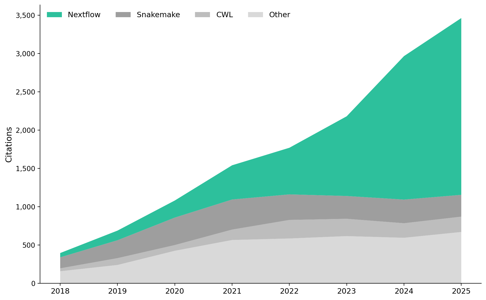

# WfMS Citation Analysis

Regenerates Supplementary Figure 1 from "Empowering bioinformatics communities with
Nextflow and nf-core" (Langer et al. 2025), showing per-year citation counts for
bioinformatics workflow management systems.



### Download plots

|                    | Absolute                                                                                    | Percentage                                                                                |
| ------------------ | ------------------------------------------------------------------------------------------- | ----------------------------------------------------------------------------------------- |
| **Without Galaxy** | [PNG](dimensions/fig1_nogalaxy_absolute.png) / [SVG](dimensions/fig1_nogalaxy_absolute.svg) | [PNG](dimensions/fig1_nogalaxy_percent.png) / [SVG](dimensions/fig1_nogalaxy_percent.svg) |
| **With Galaxy**    | [PNG](dimensions/fig1_absolute.png) / [SVG](dimensions/fig1_absolute.svg)                   | [PNG](dimensions/fig1_percent.png) / [SVG](dimensions/fig1_percent.svg)                   |

> Also available from [OpenAlex](openalex/) data: [absolute](openalex/fig1_nogalaxy_absolute.png) / [percent](openalex/fig1_nogalaxy_percent.png) / [with Galaxy](openalex/fig1_absolute.png)

## Quick start

```bash
# 1. Fetch citation data from OpenAlex (free API, ~30 seconds)
python fetch_openalex.py

# 2. Fetch citation data from Dimensions (browser scraping, ~5 minutes)
uv run --with playwright python fetch_dimensions.py

# 3. Generate plots and CSVs
python generate_plots.py
```

## Data sources

| Source           | Per-year data | API key needed | Method                                                            |
| ---------------- | ------------- | -------------- | ----------------------------------------------------------------- |
| **OpenAlex**     | Yes           | No             | REST API                                                          |
| **Dimensions**   | Yes           | No             | Browser scraping (Highcharts extraction from badge.dimensions.ai) |
| CrossRef         | Totals only   | No             | REST API                                                          |
| Google Scholar   | Totals only   | No             | `scholarly` library (very slow, gets rate-limited)                |
| Semantic Scholar | Unreliable    | No             | Free API returns incomplete citation subsets                      |
| Altmetric        | No            | Yes (403)      | N/A                                                               |
| Scopus           | Yes           | Yes            | Used in original paper but requires institutional access          |

**OpenAlex** and **Dimensions** are the two best free sources with per-year breakdowns.

## Papers included

### Galaxy
| DOI                         | Label              |
| --------------------------- | ------------------ |
| `10.1093/nar/gkae410`       | Galaxy 2024 update |
| `10.1093/nar/gkac247`       | Galaxy 2022 update |
| `10.1093/nar/gkaa434`       | Galaxy 2020 update |
| `10.1093/nar/gky379`        | Galaxy 2018 update |
| `10.1093/nar/gkw343`        | Galaxy 2016 update |
| `10.1186/gb-2012-13-10-r86` | Galaxy 2012        |
| `10.1186/gb-2010-11-8-r86`  | Galaxy 2010        |
| `10.1101/gr.4086505`        | Galaxy 2005        |

### Nextflow
| DOI                          | Label                                          |
| ---------------------------- | ---------------------------------------------- |
| `10.1038/s41587-020-0439-x`  | nf-core framework (2020)                       |
| `10.1038/nbt.3820`           | Nextflow enables reproducible workflows (2017) |
| `10.1186/s13059-025-03673-9` | Empowering bioinformatics communities (2025)   |
| `10.1101/2024.05.10.592912`  | Same paper, preprint version                   |

### Snakemake
| DOI                              | Label                                           |
| -------------------------------- | ----------------------------------------------- |
| `10.12688/f1000research.29032.2` | Sustainable data analysis with Snakemake (2021) |
| `10.1093/bioinformatics/bts480`  | Snakemake workflow engine (2012)                |

### CWL (shown separately from Other)
| DOI                              | Label    |
| -------------------------------- | -------- |
| `10.1038/nbt.3772`               | Toil     |
| `10.6084/m9.figshare.3115156.v2` | CWL v1.0 |

### Other
| DOI                             | Label               |
| ------------------------------- | ------------------- |
| `10.1016/j.jbiotec.2017.07.028` | KNIME reproducible  |
| `10.1145/1656274.1656280`       | KNIME 2.0           |
| `10.1007/978-3-030-28954-6_1`   | KNIME data analysis |
| `10.1093/bioinformatics/bts167` | Bpipe               |
| `10.1093/bioinformatics/btx152` | Pachyderm           |
| `10.1093/gigascience/giz044`    | SciPipe             |
| `10.1101/201178`                | Cromwell/GATK4      |

## Plot description

- **Stacked area charts** with Nextflow (#2DC09C) on top, then Galaxy (blue), Snakemake, CWL, and Other in grey shades
- **Two variants**: with Galaxy as a separate category, and without Galaxy
- **Two scales**: absolute citation counts and 100% stacked (percentage)

## Notes

- **OpenAlex vs Dimensions**: Both sources agree closely on trends. Dimensions may have slightly better coverage for very recent years.
- **Year range**: Edit `YEAR_MIN` / `YEAR_MAX` in each script to extend the range.
- **Adding papers**: Add new entries to the `PAPERS` list in `fetch_openalex.py` and `fetch_dimensions.py`, then re-run all three scripts.
- **Dimensions scraping**: The `fetch_dimensions.py` script extracts data from Highcharts charts on badge.dimensions.ai. If their page structure changes, the JS extraction (`window._Highcharts`) may need updating. As a fallback, use the Playwright MCP in Claude Code to manually navigate and extract data (see below).
- **Snakemake 2021 on Dimensions**: This paper (`10.12688/f1000research.29032.2`) sometimes loads on Dimensions but doesn't render a per-year chart. The total is available via their metrics API at `https://metrics-api.dimensions.ai/doi/{DOI}`.

## Manual Dimensions extraction (Claude Code fallback)

If `fetch_dimensions.py` breaks, use the Playwright MCP interactively:

1. Navigate to `https://badge.dimensions.ai/details/doi/{DOI}`
2. Accept cookies if prompted
3. Click the "Citations" tab
4. Extract data with JS: `window._Highcharts.charts.filter(c=>c)[0].series[0].data.map(p=>({year:p.category,citations:p.y}))`
5. Repeat for each DOI
